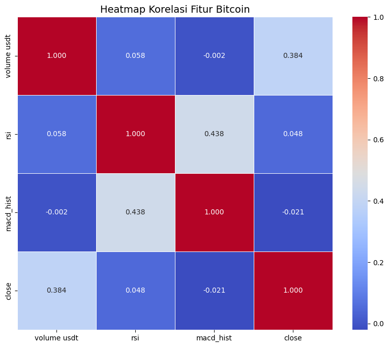
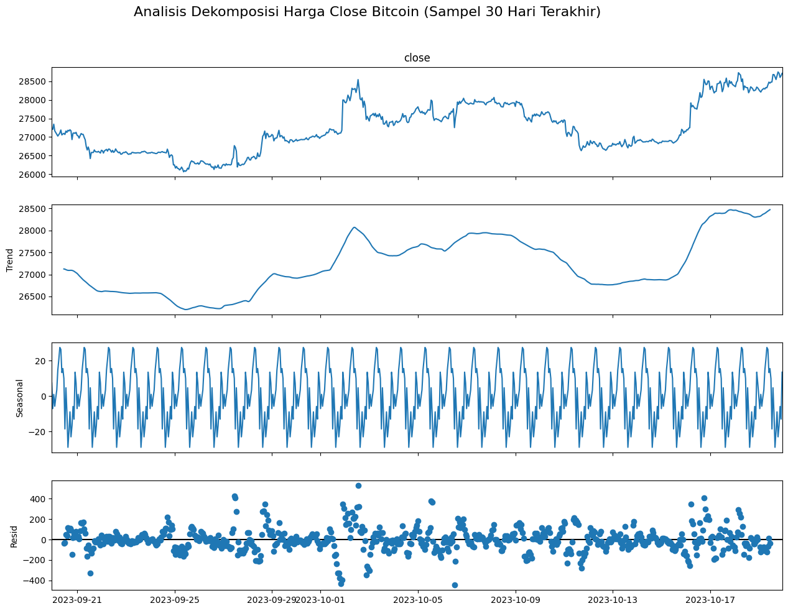
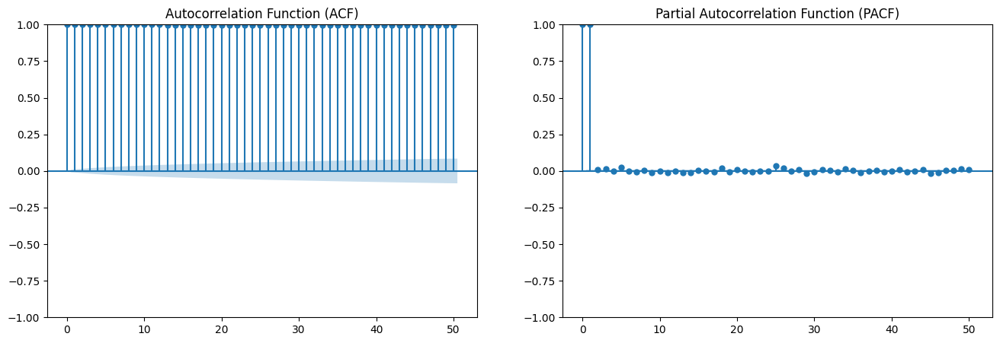
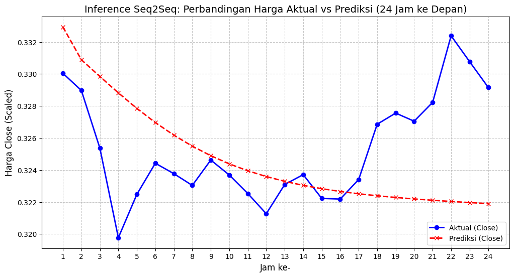

# Bitcoin Price Forecasting using Seq2Seq LSTM and TensorFlow

## Overview
This project focuses on Bitcoin price forecasting using Deep Learning approaches with Seq2Seq LSTM architectures and TensorFlow.

The project explores multivariate time series forecasting by utilizing historical Bitcoin market data and technical indicators to predict future price movements.

This repository covers the complete forecasting workflow including:
- Data preprocessing
- Time series analysis
- Feature engineering
- Statistical analysis
- Deep Learning model development
- Seq2Seq forecasting
- Model evaluation
- Forecast visualization

---

## Features
- Bitcoin multivariate time series forecasting
- Baseline LSTM model implementation
- Seq2Seq LSTM forecasting architecture
- Feature engineering using technical indicators
- Time series decomposition analysis
- ACF & PACF statistical analysis
- Forecast visualization and inference comparison
- TensorFlow/Keras implementation

---

## Dataset
The dataset contains historical Bitcoin market data including:
- Close price
- Trading volume
- RSI (Relative Strength Index)
- MACD Histogram

The dataset is used for multivariate forecasting experiments and sequence modeling.

---

## Model Architecture

### Baseline Model
- Standard LSTM forecasting model

### Advanced Model
- Seq2Seq LSTM Architecture
- Encoder-Decoder sequence learning
- Multi-step forecasting approach

---

## Technologies & Libraries
- Python
- TensorFlow / Keras
- NumPy
- Pandas
- Matplotlib
- Scikit-learn
- Statsmodels

---

## Project Structure

```bash
bitcoin-price-forecasting-seq2seq/
│
├── dataset/
│   ├── Bitcoin3.csv
│   └── README.md
│
├── images/
│   ├── acf_pacf_analysis.png
│   ├── correlation_heatmap.png
│   ├── decomposition_analysis.png
│   ├── inference_seq2seq.png
│   └── README.md
│
├── model/
│   ├── model_baseline_LSTM.keras
│   ├── model_seq2seq_LSTM.keras
│   └── README.md
│
├── notebook/
│   ├── bitcoin_forecasting_seq2seq.ipynb
│   └── README.md
│
├── requirements.txt
├── README.md
├── LICENSE
└── .gitignore
```

---

## Time Series Analysis

### Correlation Heatmap


---

### Time Series Decomposition


---

### ACF & PACF Analysis


---

## Forecasting Inference

### Actual vs Predicted Bitcoin Price


---

## Model Evaluation
The project evaluates forecasting performance using:
- Sequence prediction comparison
- Actual vs predicted visualization
- Time series pattern analysis
- Residual analysis

---

## Key Learning Outcomes
Through this project, several important concepts were explored:
- Sequence modeling using LSTM
- Encoder-decoder forecasting architecture
- Multivariate time series forecasting
- Statistical time series analysis
- Feature engineering for forecasting
- Deep Learning workflow for sequential data

---

## Future Improvements
- Experiment with Transformer-based forecasting models
- Add attention mechanisms
- Improve forecasting horizon
- Deploy forecasting model into web applications
- Integrate real-time cryptocurrency API data
- Explore probabilistic forecasting methods

---

## Author
**Mohammad Raihan Hadriansyah Prasetya**

Telecommunication Engineering Student  
AI & Machine Learning Enthusiast

